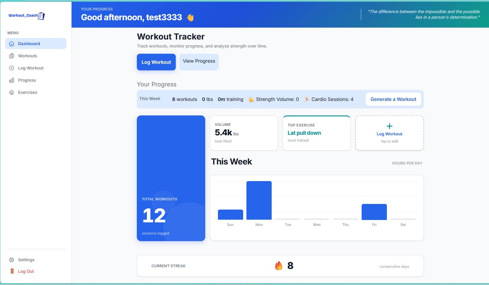
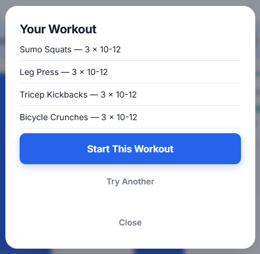
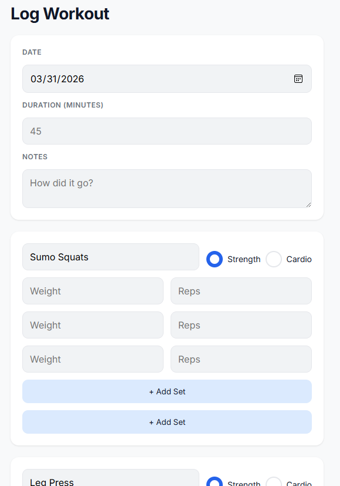
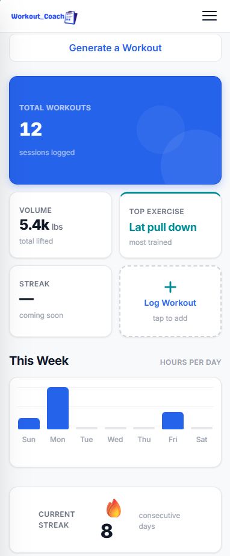

# 🏋️ Workout Tracker App

A full-featured workout tracking application built with **React, Vite, and Supabase**.
Users can log workouts, track strength and cardio sessions, view progress analytics, and generate guided workouts.

🔗 **Live App:** https://hhenske.github.io/workout-tracker

---

# 🚀 Key Features

* 📊 **Dashboard Analytics**

  * Weekly workout summary
  * Strength volume tracking
  * Cardio session tracking
  * Workout streak tracking

* 🏋️ **Workout Logging**

  * Add exercises with sets, reps, and weight
  * Support for both **strength and cardio workouts**
  * Dynamic form behavior based on workout type

* ⚡ **Workout Generator**

  * Generate workouts by type (strength/cardio)
  * Guided options (e.g., upper body, no equipment)
  * Prefills workout form for seamless logging

* 🔎 **Exercise Autocomplete**

  * Suggests exercises as users type
  * Improves speed and consistency of logging

* 📱 **Mobile-First Design**

  * Responsive layout optimized for mobile use

---

# 🛠 Tech Stack

## Frontend

* React (Vite)
* JavaScript (ES6+)
* CSS (custom, mobile-first)

## Backend / Services

* Supabase

  * Authentication
  * PostgreSQL database
  * REST API

## Deployment

* GitHub Pages

## Version Control

* Git + GitHub

---

# 🧱 Architecture Overview

```
                ┌────────────────────────┐
                │       GitHub Pages     │
                │   (Static Hosting)     │
                └────────────┬───────────┘
                             │
                             ▼
                ┌────────────────────────┐
                │     React Frontend     │
                │       (Vite App)       │
                └────────────┬───────────┘
                             │
                             ▼
                ┌─────────────────────────┐
                │        Supabase         │
                │                         │
                │  Authentication         │
                │  PostgreSQL Database    │
                │                         │
                └─────────────────────────┘
```

---

# 📁 Frontend Structure

```
src/
├── components/        Reusable UI components
├── pages/             Application views
├── services/          API + Supabase logic
├── context/           Global state (Auth)
├── hooks/             Custom hooks
├── utils/             Helper functions
├── App.jsx
└── main.jsx
```

---

# 🗄 Database Schema

```
users
  id (uuid)
  email
  created_at

workouts
  id (uuid)
  user_id (uuid)
  name
  date
  duration
  created_at
  type   (cardio / strength)

exercises
  id (uuid)
  name
  muscle_group
  type   (cardio / strength)

sets
  id (uuid)
  workout_id (uuid)
  exercise_id (uuid)
  weight
  reps
  set_number
```

---

# 🔄 Data Flow

```
User Action
  ↓
React Component
  ↓
Supabase Client
  ↓
Database
  ↓
Response
  ↓
React State Update
  ↓
UI Update
```

---

# 📸 Screenshots

### Dashboard

<p align="center">
  
</p>

### Workout Generator

<p align="center">
  
</p>

### Log Workout

<p align="center">
  
</p>

### Mobile View

<p align="center">
  
</p>

---

# ⚙️ Local Development

Install dependencies:

```
npm install
```

Run development server:

```
npm run dev
```

---

# 🚀 Deployment

Build project:

```
npm run build
```

Deploy to GitHub Pages:

```
npm run deploy
```

---

# 🔐 Environment Variables

Create a `.env` file:

```
VITE_SUPABASE_URL=your_url
VITE_SUPABASE_ANON_KEY=your_key
```

---

# 🎯 What This Project Demonstrates

* Full-stack application architecture
* Real-world database design (PostgreSQL)
* API integration with Supabase
* Dynamic UI based on user input
* State management in React
* Responsive, mobile-first design
* Production deployment workflow

---

# 👩‍💻 Author

**Holly Henske**
Frontend Developer
React | Supabase | JavaScript | CSS

🔗 GitHub: https://github.com/hhenske

